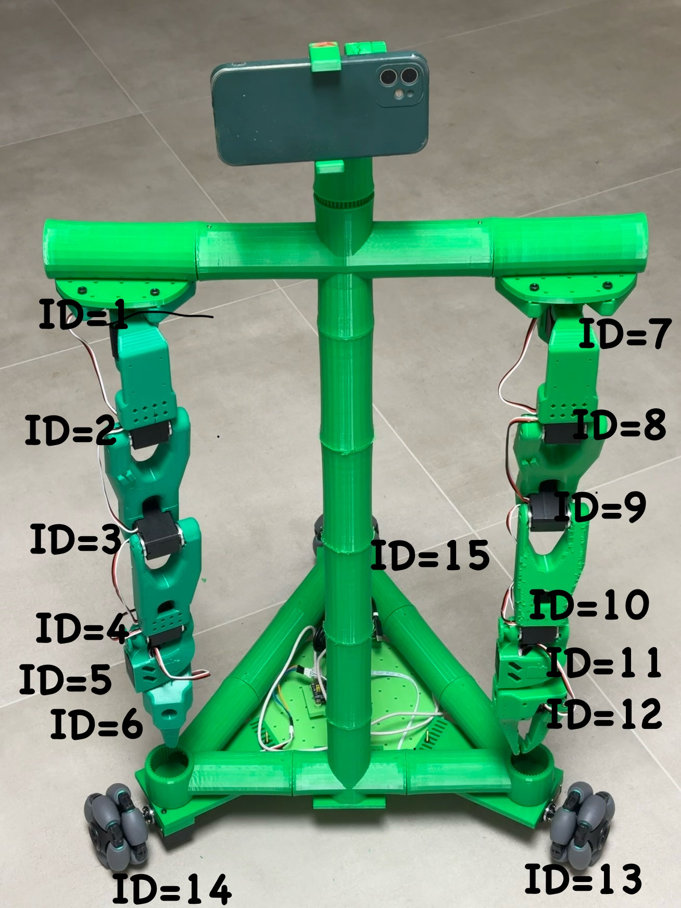

# Using the [Bambot](https://github.com/timqian/bambot) Robot with LeRobot

After you get the hardware ready following this [guide](https://github.com/timqian/bambot/tree/main/hardware), you can use the Bambot robot with LeRobot. Bambot is a two-armed robot with two wheels. The following sections describe how to use Bambot with LeRobot.

Bambot is a basicly a two-armed [lekiwi](./examples/11_use_lekiwi.md). To use Bambot with LeRobot, follow [this documentation](./examples/11_use_lekiwi.md) with the following differences:

1. Clone this repository instead of the official LeRobot repository. The modifications required for Bambot compatibility are included in [this commit](https://github.com/timqian/lerobot-bambot/commit/52fba4e85fa29e29cdd83a64ac15791e710f792a).
2. For the follower, connect 2 arms and 2 wheels to the same board. The motor IDs should be set as shown below:
    
3. For the leader, the motor IDs for both arms are the same, but only 12 motors are needed.
4. During calibration, ensure both arms are placed in the same position simultaneously.
